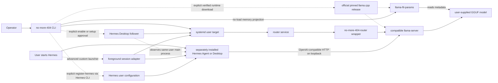

# Architecture

> **Status: current implementation.** This document describes the package,
> including its deliberate limits. It is not a future-state promise.

## Purpose

Driftless-NoMore404 provides a small lifecycle boundary around a compatible
llama.cpp server so a separately installed Hermes Agent or Hermes
Desktop can use a predictable local OpenAI-compatible endpoint.

It is an integration, not a fork or downstream distribution. The repository
contains Bash wrappers, systemd user units, configuration examples, tests, and
upstream provenance metadata. It contains no Hermes Agent code, llama.cpp code
or binaries, model weights, or upstream brand assets.

“Hermes” in this architecture means the agent/application layer. The model
loaded by llama.cpp can be any compatible, properly licensed model; it does not
need to be a Nous Hermes model.

## Component boundary

Driftless-NoMore404 owns the CLI, wrapper, unit files, and its private local
configuration. A user can point it at an independently installed llama.cpp
executable or explicitly ask it to download the pinned official runtime into
its private data directory. It does not own the Hermes process, model files,
GPU driver, or system accelerator runtime.

The integration contract between Hermes and llama.cpp is HTTP, not a source or
library dependency:

- default base URL: `http://127.0.0.1:55984/v1`;
- health probe: `http://127.0.0.1:55984/health`;
- model identifiers: section names from `models.ini`; and
- request/response shape: llama.cpp's OpenAI-compatible server API.

Hermes configuration remains outside Driftless-NoMore404's ownership. The
operator may explicitly run `register-hermes`, or approve that step during
setup, to ask Hermes's own CLI to add the configured aliases under the named
`NoMore404 Local` provider. That operation writes only
`providers.no-more-404`; it does not change Hermes's current or default model.
It also sets no provider-level preferred model.

## Installed components

### `no-more-404` CLI

The user-facing CLI manages `no-more-404.target` and reports the configured
endpoint. It can:

- start or restart the target, verify the managed service owns the configured
  listening port, and wait for `/health`;
- stop the target;
- show systemd status or follow router, watchdog, and Desktop-follower logs;
- auto-discover or explicitly download a compatible pinned llama.cpp runtime;
- project one user-selected model's memory fit without allocating its tensors
  when a compatible `llama-fit-params` companion is present, then temporarily
  load it, ask llama.cpp to fit context and GPU placement to available hardware
  with a 64K context floor, verify one local chat token, and save the measured
  context;
- explicitly register configured model aliases with Hermes's model picker
  without selecting one;
- enable or disable automatic Hermes Desktop session following without editing
  a Hermes file or launcher;
- validate configuration with `doctor`; and
- run a foreground child command while ensuring the target is available.

During ordinary operation, the CLI does not speak the model API beyond the
health probe. Initial setup additionally uses a temporary loopback-only
`llama-server` process to read `/props` and make a one-token chat request. The
response and setup log are private temporary files removed before setup exits.
Its one optional Hermes mutation is the explicit picker-registration operation
above, delegated to `hermes config set`; it does not write Hermes files
directly, store an API key, or change the active/default model selection.

Automatic context fitting begins from the GGUF's model context rather than a
fixed package value. Before `llama-server` starts, setup prefers the sibling
`llama-fit-params` utility to inspect GGUF metadata and project memory use
without allocating model tensors. The projection and real load both use
automatic placement, `fit-target = 1024`, and `fit-ctx = 64000`. A failed
projection stops before the temporary server, preserves the example
configuration, and can report a model-neutral approximate smaller file size.

For a custom server build without a compatible companion utility, setup applies
a deliberately conservative fallback: it sums standard split-GGUF shards,
compares that total with currently available physical RAM after fixed and
percentage headroom, excludes swap, and requires explicit confirmation before
an obviously oversized load. This fallback cannot accurately model every
discrete or unified accelerator layout, so it is a warning boundary rather than
an admission result.

After preflight, llama.cpp may reduce context to fit current hardware, but
`fit-ctx = 64000` prevents its fitter from reducing below the Hermes floor.
Setup rejects a context reported below that floor, records the fitted value for
Hermes registration, and leaves `n-gpu-layers` unset so llama.cpp can repeat
device placement against free memory on later loads. A successful projection
does not reserve memory; the real load remains authoritative and may still fail
if availability changes.

### `no-more-404-hermes-follower.service`

Guided setup offers this automatic integration as a separate explicit choice.
When approved, the CLI enables one lightweight user service at login. The
service itself does not start Hermes, load a model, or reserve VRAM. It observes
same-user Linux process metadata and waits for the ordinary native Hermes
Electron main process, named `Hermes` or `hermes` without a helper `--type=`
role.

When Hermes appears and the target is inactive, the follower acquires the same
private lifecycle lock used by other owning operations, refuses an occupied
configured port, starts the target, and waits for `/health`. It retains the lock
while it owns that target. After the last Hermes main process is absent for two
checks, it stops only the target it started and releases the lock. A target
that was active before Hermes appeared is preserved.

The follower does not inspect Hermes configuration, conversations, prompts, or
workspace files. It does not rewrite a desktop entry, so a normal Hermes update
cannot remove the integration. A custom renamed Electron executable is not
matched; that conservative limit avoids broad process guessing. The advanced
foreground adapter below remains available for such installations.

Startup failures are written to the user journal and retried while Hermes is
open. When the optional `notify-send` command exists, one best-effort local
desktop notice is emitted per affected Hermes session. No remote notification
or telemetry is sent.

### `no-more-404-hermes-session` adapter

The optional adapter is invoked by a user-controlled Hermes Desktop launcher;
it is not an autonomous startup mechanism. It validates an explicitly selected
root-owned Electron sandbox helper, starts the configured runtime target if
needed, launches the requested Hermes executable, and stops the target on exit
only when it owned that start. Hermes arguments and environment are inherited
unchanged. It uses the CLI's private lifecycle lock while it owns the runtime,
preventing a simultaneous persistent start from being mistaken for the
session-owned start. It is the advanced path for a renamed or otherwise custom
Desktop executable. The installer copies the adapter but does not configure or
invoke it. See [Hermes Desktop integration](HERMES_DESKTOP.md).

### `no-more-404.target`

The target groups the runtime under a single start/stop boundary. It wants the
router service but is not enabled by the installer. The runtime therefore starts
only after an explicit CLI/systemd request or a user-approved Hermes lifecycle
helper observes its session.

### `no-more-404-router.service`

The systemd user service reads the private `runtime.env` file and executes the
router wrapper. It uses:

- `Restart=on-failure` with a five-second delay;
- a limit of five starts per five minutes;
- no restart for usage, missing-input, or configuration exit codes;
- `KillMode=control-group` so managed children are stopped with the service;
- a 120-second stop timeout; and
- `NoNewPrivileges`, `PrivateTmp`, `RestrictSUIDSGID`, and a private umask as
  partial hardening.

These settings do not make the service a sandbox. The process still needs
access to the configured binary, models, cache, GPU devices, libraries, and any
other resources required by llama.cpp.

### `no-more-404-watch.service` / `no-more-404-watch.timer`

The watchdog pair closes the alive-but-hung gap. The timer is pulled in by the
runtime target (it is not enabled at login) and first runs two minutes after
the target starts, then every two minutes while the target stays active.
Stopping the target stops the timer with it.

Each oneshot run of `no-more-404-health` does the following:

- if the runtime target is inactive, it clears any stale failure count and
  exits without touching the runtime;
- if the target is active but its router is inactive, it clears stale health
  history, reports a failed watchdog run for inspection, and deliberately does
  not override the router service's bounded non-restart statuses;
- if the configured `/health` endpoint answers, it resets the failure count
  and exits;
- otherwise it increments a private counter in the state directory. After the
  configured number of consecutive failures (`HEALTH_FAILURES_REQUIRED`,
  default 2, minimum 2) it restarts the runtime target and resets the count.
  A single failed probe therefore cannot restart a healthy-but-slow router,
  and the counter file keeps the policy bounded across timer runs.

The watchdog never starts the runtime, never touches model files, and uses the
same loopback-only endpoint as the CLI.

### `no-more-404-router` wrapper

The wrapper validates configuration, creates a private cache directory, checks
that the configured executable exposes the required llama.cpp flags, builds an
argument array, and then replaces itself with `llama-server` using `exec`.
systemd therefore supervises the actual server process rather than an idle
shell parent.

The current arguments establish these policies:

- model preset supplied by absolute path;
- model autoload on request;
- bounded resident-model count;
- model unloading after llama.cpp's idle interval;
- automatic device-memory fitting with the configured context held at the
  setup-verified value;
- loopback-only bind validation;
- fixed unprivileged port;
- web UI disabled;
- metrics optional and off by default; and
- slots endpoint optional and explicitly off by default.

The wrapper refuses presets containing known example placeholders or any
`load-on-startup = true` value. This keeps initial service startup cold: the
router can become healthy without allocating model VRAM.

## Configuration and state

The normal installed locations are:

| Purpose | Location |
| --- | --- |
| CLI | `~/.local/bin/no-more-404` |
| Router wrapper | `~/.local/libexec/no-more-404/no-more-404-router` |
| Desktop follower | `~/.local/libexec/no-more-404/no-more-404-hermes-follower` |
| Runtime configuration | `~/.config/no-more-404/runtime.env` |
| Model preset | `~/.config/no-more-404/models.ini` |
| systemd user units | `~/.config/systemd/user/` |
| Install manifest and backups | `~/.local/state/no-more-404/` |
| Default llama.cpp cache | `~/.cache/no-more-404/` |
| Optional pinned llama.cpp runtime | `~/.local/share/no-more-404/llama.cpp/` |

`XDG_CONFIG_HOME` and `XDG_STATE_HOME` are honoured when configured;
executables remain under `~/.local`. The installer creates configuration and
state directories privately, installs initial
configuration with mode `0600`, and does not overwrite existing `runtime.env`
or `models.ini` files.

`runtime.env` is trusted operator input. It names the executable, preset, bind
address, port, resource bounds, timeouts, and optional cache. `models.ini` is
then interpreted by the selected llama.cpp server. Both should remain
owner-controlled. An optionally downloaded runtime is checksum-pinned and
retains its upstream licence; it is preserved by uninstall like other external
runtime data.

The separately owned Hermes configuration may contain the opt-in
`providers.no-more-404` entry. Uninstall preserves it. Re-registration adds or
updates aliases from the current preset but does not delete aliases, preserving
any separate user edits.

## Lifecycle

### Automatic Hermes Desktop session

1. The user starts Hermes Desktop normally.
2. The enabled lightweight follower recognises its same-user Electron main
   process; it never launches Hermes.
3. If the runtime target is inactive and its port is free, the follower takes
   the lifecycle lock and starts the target.
4. The follower waits for the router's `/health` endpoint. Hermes remains an
   independently owned process throughout.
5. llama.cpp loads the chosen model only when Hermes requests its alias and may
   unload it after the configured idle interval.
6. After the last Hermes main process closes, the follower stops only a target
   it owned. A separately started target remains active.

The observer normally notices either transition within one second and requires
two absent checks before cleanup. It stays enabled in the user's systemd
session only after explicit setup approval, consuming no model memory while it
waits.

### Start

1. The operator runs `no-more-404 start`.
2. The CLI asks the systemd user manager to start the target.
3. The target starts the router service.
4. The service loads `runtime.env` and runs the wrapper.
5. The wrapper validates paths, policy, and required upstream flags.
6. The wrapper `exec`s `llama-server` with no model configured to preload.
7. The CLI confirms the service's main PID owns the configured listening port
   and polls `/health` twice per second until the configured startup timeout.
8. The CLI reports the `/v1` base URL after a successful probe.

If the health deadline expires, the CLI reports failure and prints service
status. If that command started or restarted the target, it also attempts to
stop the failed runtime and reports if cleanup itself fails. A target that was
already active before `start` is left for the operator to inspect with `status`
and `logs`.

### First model request

Hermes sends an OpenAI-compatible request using a model alias from the preset.
llama.cpp resolves that alias and loads the corresponding user-supplied model.
Loading latency and memory use belong to the upstream server, model, and local
hardware. Context is fixed at the value proven during setup while llama.cpp is
free to recompute device placement from currently available memory.

NoMore404 enforces one resident-model slot and enables llama.cpp autoloading.
When Hermes first sends a request for a different picker alias, the pinned
llama.cpp router does not evict a model that is serving work. It queues the new
request, waits until the existing worker is no longer busy, unloads that worker,
loads the requested model, and routes the queued request. NoMore404 does not
manually kill a worker or track llama.cpp's changing child ports.

Each model is fitted independently by `setup` or `add-model`; its proven
context is stored in its preset section and registered as that alias's Hermes
context. Adding an alias does not preload it. Hermes remains responsible for
the user's selection, while the router is responsible only for carrying out
the resulting request safely.

### Idle

After `IDLE_SECONDS` without qualifying activity, llama.cpp is asked to unload
model weights and release their model/KV-cache residency. The lightweight server
process remains active and continues to own the endpoint. Idle unloading is an
upstream llama.cpp feature, not a Driftless-NoMore404 polling loop.

### Stop

Stopping `no-more-404.target` stops the bound router service. systemd sends
termination through the service control group and applies its stop timeout. The
goal is that workers started inside that control group do not survive the
managed runtime.

This is not a promise to discover or kill unrelated, pre-existing
`llama-server` processes outside the unit's control group.

### Foreground and Hermes-session ownership

`no-more-404 run -- COMMAND ...` records whether the target was already
active. If it starts the target, it stops the target when the foreground child
finishes or the wrapper exits. If the target was already active, it leaves it
active. Signals handled by the CLI are forwarded to the immediate child. A
private runtime lock serialises this ownership decision; a second concurrent
`run` command is rejected rather than risking premature target shutdown.
`start` and `restart` take the same lock across their ownership decision and
readiness check. If a `run` session already holds it, they fail explicitly;
otherwise a completed `start` establishes the active target before releasing
the lock, so a later `run` observes that it does not own the target.

The optional Hermes adapter uses the same lock before checking and starting
the target. If it starts the target, it retains the lock until Hermes exits and
then stops that owned target. If the target was already active, the adapter
releases the lock and preserves the target on exit. This prevents a concurrent
manual `start` from returning success for a target the adapter later treats as
session-owned.

The automatic follower applies the same ownership rule. It holds the lock only
when it started the target. If another lifecycle operation owns the lock, it
waits rather than competing; if the target was already active, it observes but
does not claim it. While Hermes remains open, stopping a follower-owned target
causes the follower to restore it. Disable automatic following first when the
operator wants the runtime to remain off while Hermes stays open.

## Recovery semantics

The current release combines bounded process-exit recovery with a bounded HTTP
health watchdog. It does not attempt to infer whether a healthy endpoint is
producing useful model responses.

| Condition | Current behavior |
| --- | --- |
| `llama-server` exits unexpectedly | systemd attempts a bounded restart |
| Wrapper finds invalid configuration | exits with a non-restarted configuration status |
| Binary or preset is missing | exits with a non-restarted missing-input status |
| Explicit `start`/`restart` never reaches `/health` | CLI fails, prints service status, and attempts to stop a target it started or restarted |
| Model unloads after idle | llama.cpp keeps the router alive and reloads on demand |
| Foreground child exits after `run` started the target | CLI stops the target it owned |
| Foreground child exits after a separate `start` | target stays active; model can idle-unload |
| `start` or `restart` races an active `run` session | command is rejected before changing the target |
| User starts native Hermes Desktop with automatic following enabled | follower starts the target, waits for health, and owns it for that Desktop session |
| Hermes Desktop closes after the follower started the target | follower stops its owned target after the close debounce |
| Hermes Desktop opens while a separately started target is active | follower preserves that target and does not stop it later |
| Hermes uses a custom renamed executable | automatic detection does not guess; use the explicit adapter |
| Server process is alive but `/health` is unresponsive | watchdog restarts the target after the configured consecutive failures |
| A request or model worker wedges and `/health` also stalls | watchdog restarts the target after the configured consecutive failures |
| A request wedges while `/health` still answers | operator uses the explicit restart command |
| Another process occupies the configured port | startup fails; no automatic port reassignment |

There is no systemd watchdog heartbeat, request-progress detector, or hang
timeout that kills and replaces a live server mid-request. The timer-based
watchdog covers the case where the server stops answering `/health` while
staying alive: it is bounded and owned by this package. An inactive router
under an active target is reported but not automatically restarted, preserving
the deliberate non-restart policy for invalid configuration and missing
inputs. A request that hangs without stalling the health endpoint is
still not detected; `no-more-404 restart` remains the explicit recovery
action for a suspected hang, provided no foreground `run` session currently
owns the lifecycle lock. Restart validates required commands, endpoint
configuration, readiness timeout, lock availability, and an inactive
target's port before it asks systemd to restart anything.

## Security boundaries

### Network

The wrapper accepts only the explicit loopback addresses `127.0.0.1` and
`::1`; examples use the literal IPv4 loopback address. The package has no
supported remote-bind mode and no additional authentication layer.
`--no-webui` removes the upstream browser
surface but does not turn the model API into a hardened multi-user service.

Tunnels, reverse proxies, port forwarding, containers, or unusual network
namespaces can expand exposure beyond the intended loopback boundary. They are
outside this architecture.

### Files and processes

The service runs with the current user's authority. systemd hardening reduces a
few classes of privilege change and temporary-file sharing, but it does not
isolate the user's filesystem or GPU. A malicious executable, model, dynamic
library, or input may exceed the protections this wrapper provides.

Only absolute executable, preset, and cache paths are accepted where the
wrapper controls them. This prevents working-directory ambiguity but does not
establish artifact trust. Operators should pin sources and verify checksums.

The automatic Desktop follower reads only current-user process ownership,
process names, first command arguments, and Electron role arguments under the
Linux process filesystem. It uses those fields solely to identify the native
Hermes main process. Its optional local notification contains no model name,
path, prompt, or conversation content.

### Data

Prompts and generated content travel directly between Hermes and the local
llama.cpp endpoint. Driftless-NoMore404 does not add telemetry or an intermediate
request log. llama.cpp and Hermes retain their own logging and storage behavior,
which must be reviewed separately before processing sensitive data.

## Upstream and licensing boundary

- Hermes Agent is a separately installed MIT-licensed project maintained by
  Nous Research.
- llama.cpp is an MIT-licensed project maintained by the ggml authors under
  ggml-org. It may be independently installed or explicitly fetched from the
  checksum-pinned official release recorded by this package.
- Model artifacts carry their own licenses and acceptable-use conditions.
- Accelerator runtimes and prebuilt binary dependencies may add further terms.
- Driftless-NoMore404's compatibility lock records an upstream revision but does
  not vendor it.

See [`THIRD_PARTY_NOTICES.md`](../THIRD_PARTY_NOTICES.md) for attribution and
naming details.

## Known limitations

- The watchdog detects an unresponsive router health endpoint, not a single
  wedged generation while `/health` continues to answer.
- Linux systemd user sessions only in the current package.
- Hermes Desktop has its own Local Models manager. NoMore404 is an independent
  alternative for user-selected GGUFs, and simultaneous ownership of the same
  llama.cpp process or model load is unsupported.
- No automatic Hermes installation, startup, model choice, or upgrade.
  The optional follower reacts only after the user starts native Hermes
  Desktop. Picker registration is an explicit setup choice or command and is
  limited to the `providers.no-more-404` entry.
- No model downloader or automatic llama.cpp updater. Only an explicit,
  checksum-pinned initial runtime download is supported.
- Setup selects a free loopback port from a bounded range; later port conflicts
  remain visible errors rather than triggering an unbounded search.
- No authentication beyond the enforced local bind boundary.
- The automatic follower recognises native Electron executables named `Hermes`
  or `hermes`; deliberately renamed custom builds require the explicit adapter.
- No remote failure notifications. Automatic-follow startup failure has a
  best-effort local `notify-send` notice when available; all details remain in
  command results, `doctor`, systemd status, and local journal logs.
- Hardware sizing is projected by llama.cpp without tensor allocation when its
  companion tool is available and confirmed by one temporary model load. It is
  not a reservation or a guarantee against later memory contention or every
  backend-specific fitting defect. The fallback for custom builds is a coarse,
  physical-RAM-only warning.
- No named-model recommendation, ranking, or preference. A failed memory fit
  can produce only a conservative approximate GGUF file-size ceiling; aliases
  still come only from the user's preset.
- Compatibility depends on recent llama.cpp multi-model flags and is checked at
  runtime rather than guaranteed across upstream versions.
- Tests validate shell syntax, policy guards, wrapper arguments, sizing and
  runtime-download failure paths, and unit-file structure. They do not yet
  constitute a long-running soak or exhaustive backend fault-injection test.

These limitations are part of the public contract for this release and
should remain visible until the implementation and tests genuinely change.
